# WarZone
This is a collaborative project which mathematically models the likelihood of two countries going to war. Scroll down to see models with different parameters and phase plots.

## Simple Arms Race Model: Aggressive vs. Passive
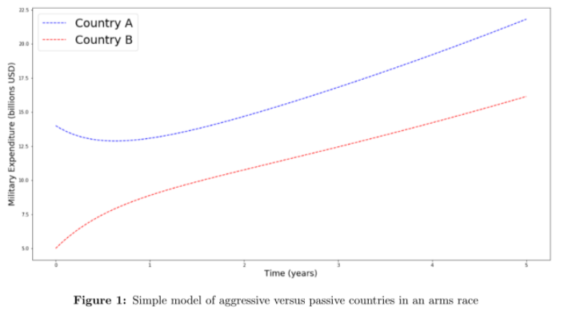

### Phase Plot: Simple Aggressive vs. Passive
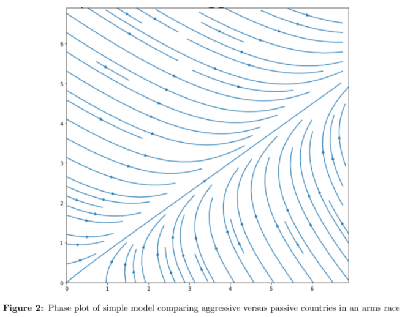

## Arms Race Model: Aggressive vs. Passive
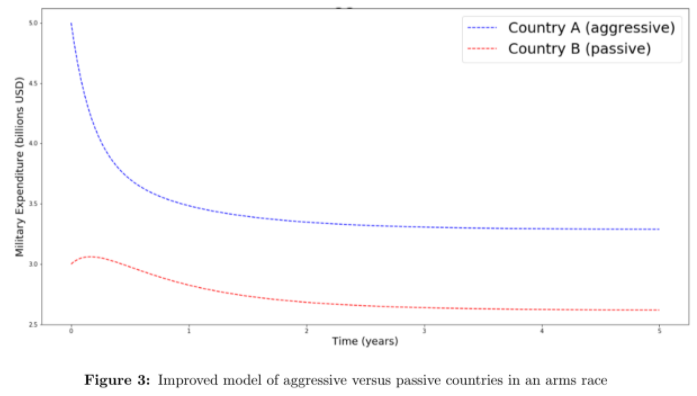

### Phase Plot: Aggressive vs. Passive
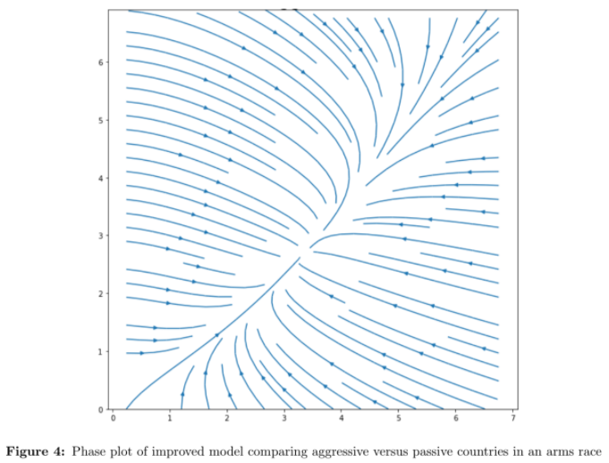

#### Real World Example: Aggressive vs. Passive
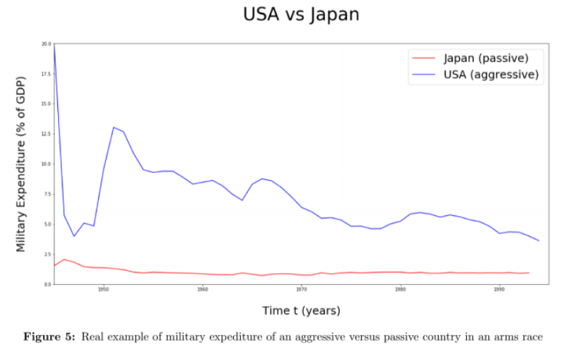

## Arms Race Model: Aggressive vs. Aggressive
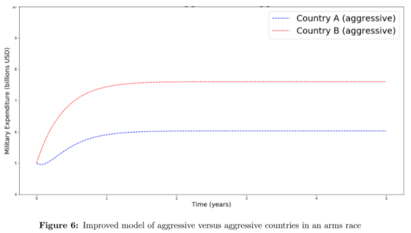

### Phase Plot: Aggressive vs. Aggressive
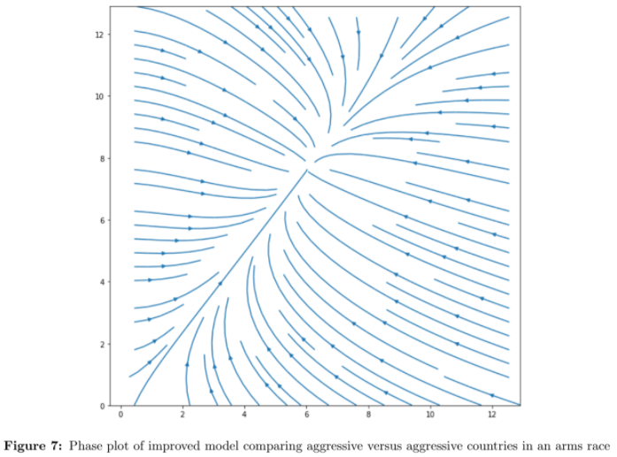

#### Real World Example: Aggressive vs. Aggressive
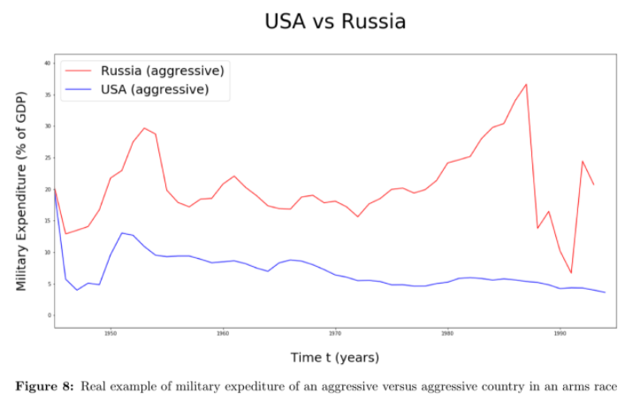

## Arms Race Model: Passive vs. Passive
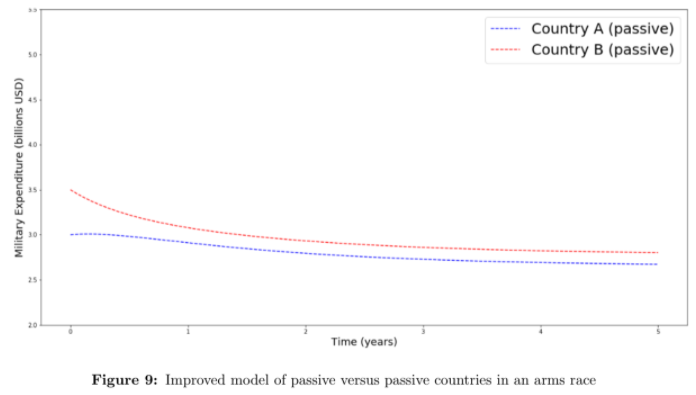

### Phase Plot: Passive vs. Passive
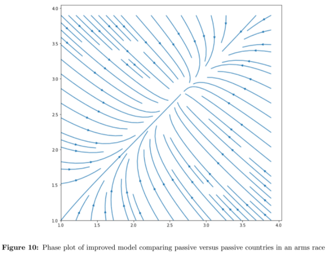

#### Real World Example: Passive vs. Passive
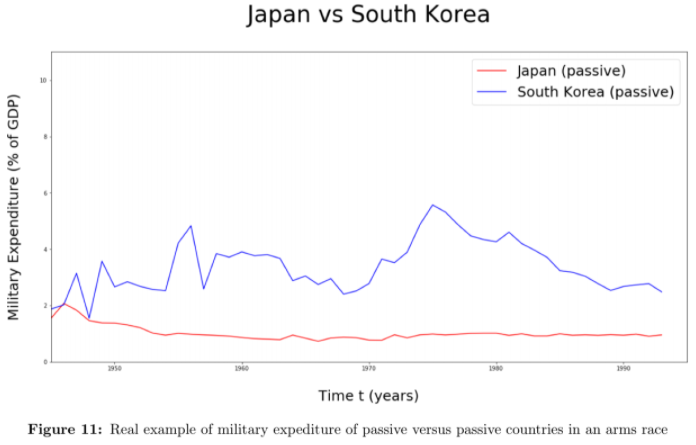